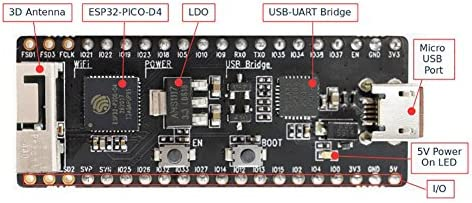
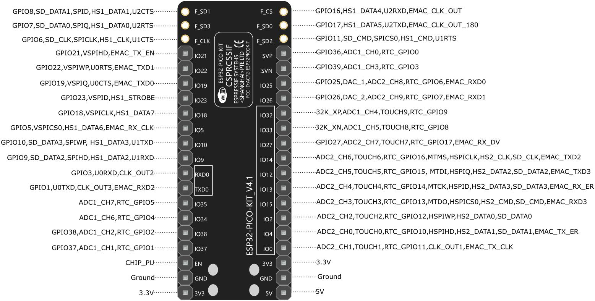

\page PayloadPLControllerComponent Payload::PLController Component
# Payload::PLController (Active Component)

## 1. Introduction
`Payload::PLController` is an F' active component that collects data from the ESP32 Payload processor. 

### 1.1. Hardware Overview

**I2C interface:**
The ESP32 receives commands and reports data via an I2C interface.

**Data sheet:** For more details, see the [manufacturer's data 
sheet]https://www.espressif.com/sites/default/files/documentation/esp32-pico-d4_datasheet_en.pdf).




### 1.2. Component Overview

## 2. Assumptions
None.

## 3. Requirements
| Requirement ID | Description                                                                                      | Verification Method |
|----------------|--------------------------------------------------------------------------------------------------|---------------------|
| PL-CNTRL-001    | The `Payload::PLController` component shall be able to send commands to the ESP32 payload processer via I2C | |
| PL-CNTRL-002    | The `Payload::PLController` component shall be able to receive periodical status updates  from the ESP32 via I2C | |
| PL-CNTRL-003    | The `Payload::PLController` component shall be able to receive experiment results from the ESP32 via I2C following experiment completion | |
| PL-CNTRL-004    | The `Payload::PLController` component shall emit warning events in case of experiment failure | |
| PL-CNTRL-005    | The `Payload::PLController` component shall emit warning events in case of I2C error | |
| PL-CNTRL-006    | The `Payload::PLController` component emit events to indicate experiment active and inactive conditions | |
| PL-CNTRL-007    | The `Payload::PLController` component shall be able to receive battery levels as an input | |
| PL-CNTRL-008    | The `Payload::PLController` component shall be able to change behavior based on the system's power mode | |

## 4. Design 

### 4.1. Component Diagram
The diagram below shows the `PLController` component.

### 4.2. Ports
`PLController` has the following ports: 

| Kind | Name | Port Type | Usage |
|------|------|-----------|-------|
| `guarded input` | `Read` | `Svc.Sched` | Port to send experiment telemetry to ground |
| `output` | `read` | `Drv.I2c` | Port that reads data from device |
| `output` | `write` | `Drv.I2c` | Port that writes data to device |
| `output` | `getBattery` | `??` | Port that gets battery level from other component |
| `input` | `pwrState` | `PowerModes` | Port that gets battery level from other component |
| `command recv` | `cmdIn` | `Fw.Cmd` | Command receive |
| `command reg` | `cmdRegOut` | `Fw.CmdReg` | Command registration |
| `command resp` | `cmdResponseOut` | `Fw.CmdResponse` | Command response |
| `event` | `Log` | `Fw.Log` | Port for emitting events |
| `text event` | `LogText` | `Fw.LogText` | Port for emitting text events |
| `time get` | `Time` | `Fw.Time` | Port for getting the time |
| `telemetry` | `Tlm` | `Fw.Tlm` | Telemetry port |

### 4.3. Defined Types

`PLController` uses the following defined types:

1. [`StatusUpdate`](../../PLController/PLController.fpp) contains:

| Kind | Usage | 
|------|------|
| `[16] I32` | Temperature values for the 16 sensors |
| `I8` | Battery Levels |
| `[2] U8` | Heater Wattages for 2 battery heater cartridges |
| `Fw.Time` | ESP32 local time constant time |

2. [`ExpResult`](../../PLController/PLController.fpp) contains:

| Kind | Usage | 
|------|------|
| `[16] I32` | Temperature values for the 16 sensors |
| `I8` | Battery Levels |
| `[2] U8` | Heater Wattages for 2 battery heater cartridges |
| `Fw.Time` | ESP32 local time constant time |

3. [`ExpParams`](../../PLController/PLController.fpp) contains:

| Kind | Usage | 
|------|------|
| `U8` | Experiment Length |
| `[256] U8` | heater Wattage (Integer) |
| `[256] U8` | heater Wattage (Decimal) |


### 4.4. Types

`Imu` defines the following types:

1. [`I2cDevAddr`](../Imu.hpp) is a C++ enumeration that defines the type
of an I2C device address.
The I2C bus uses the device address to identify the device.

### 4.5. State
`PLController` maintains the following state:
1. `m_i2cDevAddress`: A value of type `U8` that stores the address of the ESP32 processor. The I2C bus uses the device address to identify the device

### 4.6. Runtime Configuration
At startup, the F Prime software must call the `setup` method of the
`Imu` object.
```
void setup(I2cDevAddr::T devAddress);
```
`devAddress` is the I2C device address.
The value should correspond to the configuration of the hardware.

### 4.7. Port Handlers

#### 4.7.1. Run
Ensures that the sensor has been properly setup and calls the `updateAccel` and `updateGyro` helper functions. 

### 4.8. Helper Functions

#### 4.8.1. `...` 
Returns the read data from the sensor.

## 5. Ground Interface

### 5.1. Commands

`Imu` provides the following commands:

| Kind | Name | Description |
|------|------|-------------|
| `async` | `ExpStart` | Command to tell ESP32 to begin experiment |
| `async` | `ExpStop` | Command to tell ESP32 to halt experiment |
| `async` | `ExpConfig` | Command to tell ESP32 the experiment parameters |
| `sync` | `PLStatus` | Command to request a payload status update from the ESP32 |
| `sync` | `ExpResults` | Command to request experiment results |

### 5.2. Telemetry

`PLController` provides the following telemetry channels:

| Name | Type | Description |
|------|------|-------------|
| `payloadStatus` | `StatusUpdate` | Payload status updates |

### 5.3. Events

| Name | Description |
|------|-------------|
| `ExperimentComplete` | Report experiment status |
| `PayloadUpdates` | Report periodic payload updates |
| `PayloadOverheat` | Warning when payload temp sensors return high values |
| `PayloadHeaterError` | Warning when heater is non-responsive |
| `PayloadSensorError` | Warning when payload sensor reports irregularity in measurements |
| `I2cTelemetryError` | Error occurred when requesting telemetry |
| `I2cConfigError` | Configuration failed |
| `I2cModeError` | Device was not taken out of sleep mode |